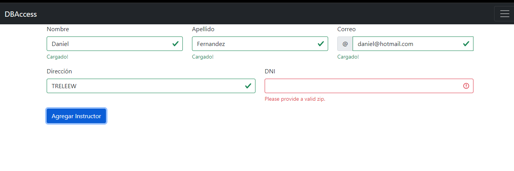
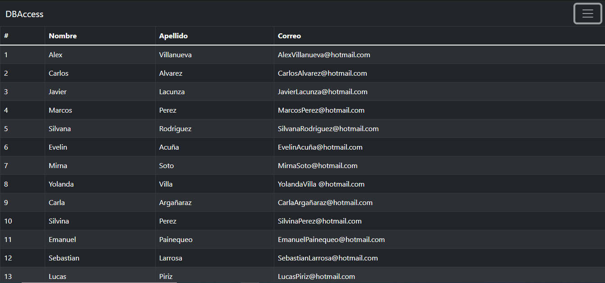
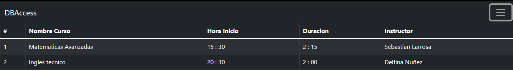
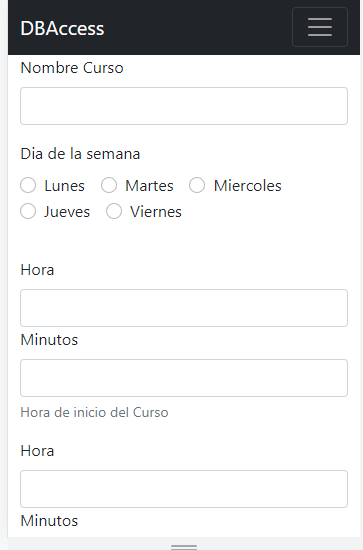
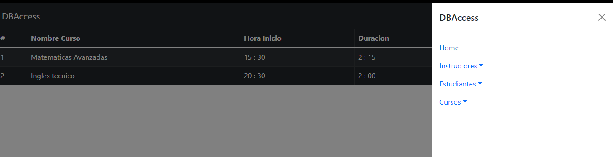
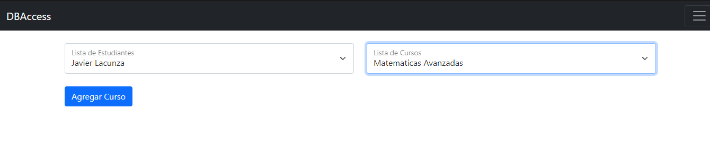
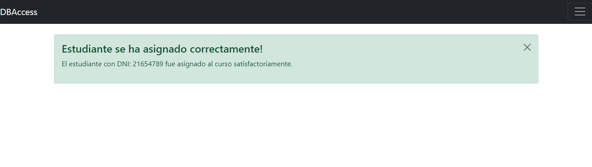

# DBAccess

## About

- App desarrollada con React, Redux, Node, PostgreSQL, Sequelize y Express

## Funcionalidades: 
- Crear Curso
- Listar Cursos
- Crear Instructor
- Listar Instructores
- Listar Estudiantes
- Asignar Estudiante a un Curso
- Cargar Estudiantes e Instructores mediante planilla de Excel

__Agregar Instructor__: 

__Listado de Instructores__: 

__Listado de Cursos Creados__: 

__Agregar Curso__: 

__Menu desplegable__: 

__Asignar Estudiante a Curso__: 

